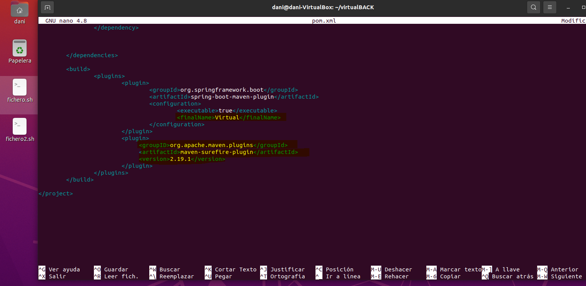
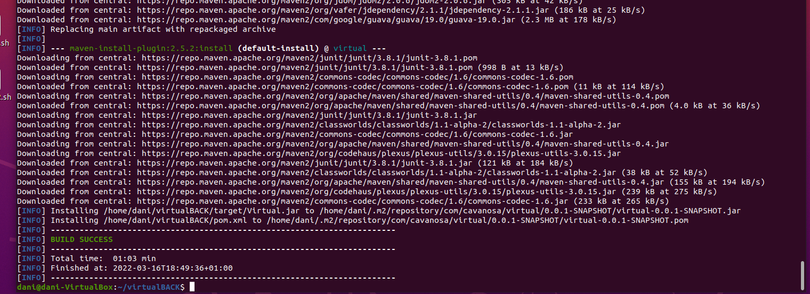
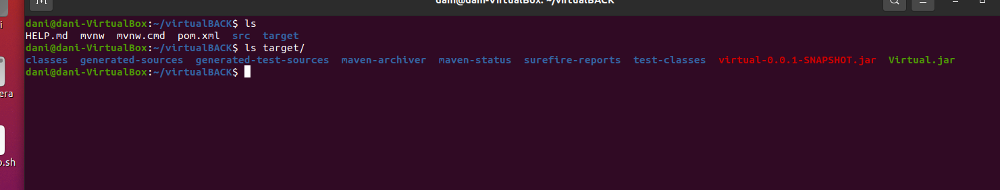
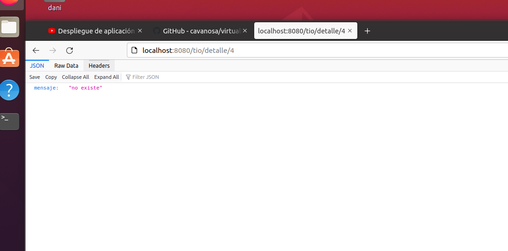
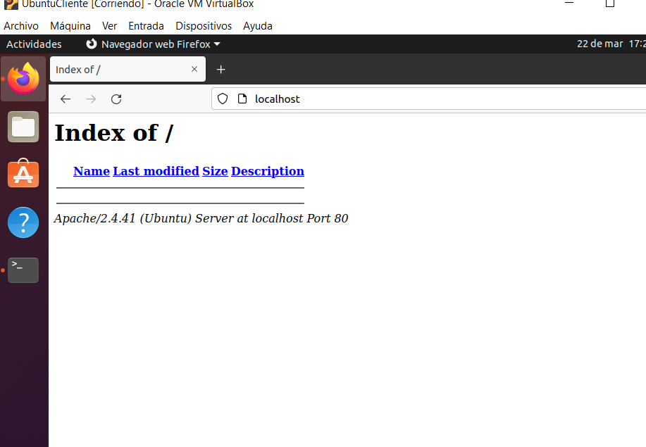
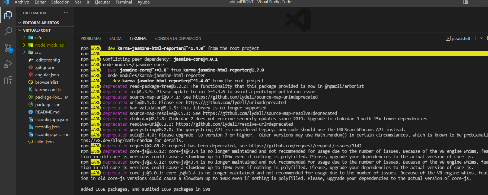
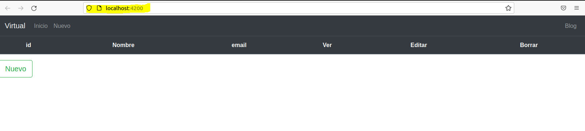

---
title:Despliegue de Aplicacion vps
--
author:Daniel Vazquez Vidal

---

# Despliegue de Aplicación VPS

> Tarea realizada por: Daniel Vázquez Vidal

## Pasos mas importantes en la instalación y el despliegue

Para ejecutar este trabajo, necesitamos tener instalado:

- Mysql
- Apache
- vsftpd
- Java

1. Para la ejecución del despliegue de la aplicación, se utilizo el siguiente tutorial y se siguieron los siguientes repositorios para la extracción del contenido tanto `BACK` como `FRONT` de la aplicación.

TUTORIAL: https://youtu.be/ibIn4qIniv8

REPOSITORIO PARTE DEL BACK:  [https://github.com/cavanosa/virtualBACK]

REPOSITORIO PARTE DEL FRONT:  [https://github.com/cavanosa/virtualFRONT]

### PARTE DEL BACK-END

2. En el proceso del BACK, hay que modificar el `POM` de la siguiente forma para que deje de dar errores.

3. Después de realizar ese paso realizamos un `mvn install` y vemos que todo va bien.

Aparecerán los `.jar` después de realizar esto.

Ejecutamos ese `.jar` con el comando java `-jar` `target/virtual.ja`r y comprobamos que funciona accediendo al navegador y accediendo a algún apartado de la aplicación.

Muestra un array de los elementos creados, como esta vacío, indica que no existe.

Con esto el BACK estaría terminado.

### PARTE DEL FRONT-END

Instalas apache, y su página `Index.html` la mueves por ejemplo a tu sitio local para que quede así:

En Visual Studio Code , realizamos un `npm update` para que nos genere los `node_modules`.

Realizamos un `ng serve -o` y vemos que funciona:

